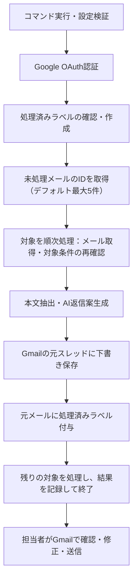

# AI Customer Support Assistant

小規模ECショップの問い合わせ対応を支援する、Gmail連携のAI返信案作成ツールです。メールごとに返信文を準備する負担を減らすことを目的に、**メール取得 → AI返信案生成 → Gmail下書き保存**を自動化します。

**メールは自動送信しません。担当者がGmailで下書きを確認・修正し、送信します。**

- **処理対象：** 受信トレイ内の未処理メール。デフォルトで1回最大5件
- **処理済み管理：** 下書き保存後に「AI処理済み」ラベルを付与
- **主要技術：** TypeScript / Node.js / Gmail API / OpenAI API / Google OAuth 2.0
- **実行方式：** コマンドから起動し、対象の処理が終わると終了

## 想定している課題

小規模ECショップでは、少人数で注文管理や発送と並行して問い合わせに対応する場面を想定しています。

- メールごとに返信文を作成する負担がある
- 返信の準備に時間がかかり、対応が遅れる
- AIを活用したい一方、誤った案内の自動送信は避けたい

## 解決方法

AIが返信案を作成し、普段利用するGmailの下書きに保存します。担当者は下書きを起点として、事実確認・修正・送信を行えます。

処理件数を制限し、下書き作成済みのメールをラベルで管理することで、少量ずつ処理しながら結果を確認できる構成にしています。

## 主な機能

| 機能 | 実装内容 |
|---|---|
| 未処理メールの取得 | 受信トレイ内の「AI処理済み」ラベルがないメールを取得 |
| 対象の絞り込み | 送信済み・下書き・迷惑メール・ゴミ箱を除外。既読・未読は不問 |
| 本文の抽出 | プレーンテキストを優先し、HTMLメールはテキストに変換 |
| AI返信案の生成 | 件名と本文の先頭最大6,000文字をOpenAI APIへ渡して生成 |
| Gmail下書き保存 | 元メールのスレッドに返信の下書きを作成 |
| 処理済み管理 | 下書き保存後に元メールへ「AI処理済み」ラベルを付与。ラベルがなければ自動作成 |
| 件数制限 | デフォルトで1回最大5件。環境変数で変更可能 |
| エラー処理 | メール単位の失敗を記録し、残りの対象メールの処理を継続 |

返信生成時は、丁寧な日本語で200〜400文字程度の返信を作成し、不明な配送状況・料金・返金・在庫・納期を断定しないよう指示しています。これらはプロンプトによる指示であり、生成結果の正確性や文字数を保証するものではありません。

## 処理の流れ



図は正常時の流れです。処理中のラベル更新によって取得対象が変わらないよう、最初に上限件数分のメールIDを確定します。失敗・スキップも選択件数に含め、代わりのメールを追加取得しません。

「AI処理済み」は下書き作成処理の完了を表し、担当者による確認や送信の完了を表すものではありません。

## 使用技術

| 技術 | 用途 |
|---|---|
| TypeScript | アプリケーション実装。`strict`を有効化 |
| Node.js | コマンド実行環境 |
| Gmail API / googleapis | メール取得・下書き作成・ラベル管理 |
| Google OAuth 2.0 | Gmailアカウントへのアクセス認証 |
| OpenAI API / openai | Chat Completionsによる返信案生成 |
| html-to-text | HTMLメール本文のテキスト変換 |
| dotenv | ローカル環境変数の読み込み |
| tsx | TypeScriptの直接実行とテスト実行 |
| node:test / node:assert | モックを使用した自動テスト |

使用するOpenAIモデルは環境変数 `OPENAI_MODEL` で指定します。

## 安全性・運用面での工夫

### 下書き保存までに限定

メール送信APIは呼び出しません。メールの削除やゴミ箱への移動も行いません。送信前に担当者が内容を確認する運用です。

OAuthでは `gmail.modify` と `gmail.compose` を要求します。送信しないという制約はアプリケーションの実装によるもので、OAuth権限自体が送信を禁止する構成ではありません。

### 処理量と重複処理の管理

- デフォルトで1回最大5件に制限
- 処理済みラベルを検索時とメール取得時の両方で確認
- 下書き保存成功後にのみ処理済みラベルを付与
- 空の返信案や下書きIDを取得できない結果は失敗として扱う
- 返信生成は対象メールにつき1回の実行内で最大1回

### 秘密情報とログの管理

APIキーは環境変数、OAuth認証情報はローカルファイルで管理します。`.env`、`credentials.json`、`token.json` などの秘密情報はGit管理から除外し、リポジトリへ追加しません。

**APIキー、OAuth認証情報、実際のメール本文・メールアドレスはGitへ追加しないでください。** `.gitignore` は、既に追跡されているファイルや過去のコミットから情報を削除するものではありません。

処理ログにはイベント名、失敗段階（`fetch` / `generate` / `draft` / `label`）、選択・成功・失敗・スキップ件数を出力します。メール本文・件名・メールアドレス・メールID・API例外の生データは出力しません。初回認証時には、認証操作に必要なURLを表示します。

### 入力検証と障害対応

- 必須環境変数と処理件数の妥当性を認証前に検証
- メールヘッダー値に改行が含まれる場合は下書き作成を拒否
- OAuth認証の `state` を検証し、認証待機は5分でタイムアウト
- Gmailの通常API呼び出しとOpenAI API呼び出しには60秒のタイムアウトを設定
- 通常APIリクエストの自動リトライを無効化
- メール単位の失敗後も次の対象を処理

認証や対象一覧取得など、実行全体に必要な処理が失敗した場合は停止します。失敗を含む実行は終了コード `1`、失敗がなければ `0` で終了します。`startup_failed` が出た場合は、必須設定・認証・一覧取得などを確認してください。

## セットアップ方法

### 1. 必要な環境を用意

- Node.jsとnpm
- 問い合わせ対応用のGmailアカウント
- Gmail APIを有効にしたGoogle Cloudプロジェクト
- OpenAI APIキーと使用するモデル名

問い合わせ内容を自動判別する機能はないため、問い合わせ専用のGmailアカウントでの利用を想定しています。

### 2. 依存関係をインストール

リポジトリのルートで実行します。

```sh
npm ci
```

### 3. Google OAuthを設定

Google CloudでOAuth同意画面とデスクトップアプリ用のOAuthクライアントを設定します。

ダウンロードしたクライアント設定を、プロジェクトルートの `credentials.json` に配置してください。このファイルはGitへ追加しません。

### 4. 環境変数を設定

プロジェクトルートに `.env` を作成し、次の変数をローカルで設定します。

| 変数 | 必須 | 内容 |
|---|---|---|
| `OPENAI_API_KEY` | 必須 | OpenAI APIキー |
| `OPENAI_MODEL` | 必須 | 使用するモデル名 |
| `MAX_EMAILS_PER_RUN` | 任意 | 1回の処理上限。未指定時は `5` |

`MAX_EMAILS_PER_RUN` は正の安全な整数を受け付けます。空文字・0・負数・小数などはエラーになります。

**現実装では5件を超える値も設定できます。1回最大5件で運用する場合は、未指定または `5` にしてください。**

## 実行方法

開発時は次のコマンドで実行します。

```sh
npm run dev
```

ビルドして実行する場合：

```sh
npm run build
npm start
```

初回実行では、表示された認証URLをブラウザで開き、Google認証を完了します。取得したトークンはローカルの `token.json` に保存され、次回以降に利用されます。

実行すると、実際のGmail・OpenAI APIを呼び出し、Gmailに下書きとラベルを作成します。処理終了後、Gmailで下書きを確認・修正して送信してください。

## テスト方法

```sh
npm run test
npm run typecheck
npm run build
```

自動テストは架空データとAPIモックを使用します。実際のGmail・OpenAI APIは呼び出さず、`.env`、`credentials.json`、`token.json`、`mail.txt` も読み込みません。

主な検証内容：

- デフォルト最大5件の処理と件数設定の検証
- 処理対象の選別とページネーション
- 下書き保存後にラベルを付ける処理順序
- 送信・削除・ゴミ箱移動APIを呼び出さないこと
- 各処理段階の失敗後に後続メールを処理すること
- 空の返信案や下書きID欠落時に処理済みとしないこと
- HTML本文抽出と不正ヘッダーの拒否
- ログにメール内容や生の例外情報を出力しないこと

## 現在の制限

- **単発実行です。** 定期実行・常時監視・Web管理画面は実装していません。
- **問い合わせの自動分類は行いません。** 条件に合う受信トレイ内のメールは、過去のメールも含めて対象になります。
- **注文・在庫・配送情報との連携はありません。** AIの返信案は担当者による事実確認が必要です。
- **本文のAI入力は先頭最大6,000文字です。** 添付ファイルやスレッド全体の会話履歴は解析しません。
- **個人情報の自動匿名化はありません。** 件名や本文に含まれる情報はOpenAI APIへ送られます。
- **重複下書きを完全には防げません。** 下書き作成後のラベル付与失敗や、作成結果を受信できない通信障害では、再実行時に重複する可能性があります。`draft`・`label` 段階で失敗した場合は、再実行前にGmailの下書きを確認してください。
- **同時実行を防ぐ仕組みはありません。** 複数プロセスを重ねて実行しない運用が必要です。
- **処理状態を記録する独立したDBはありません。** Gmailのラベルで管理しています。
- **古いメールの処理順は保証しません。** 失敗の繰り返しや新着の増加によって、処理が遅れる可能性があります。

## Future Improvements

以下は未実装の改善候補です。

- 処理状態・下書きIDの永続化と障害時の復旧
- 同時実行制御による重複処理の防止
- 定期実行と障害通知
- Gmailの差分取得による取得処理の効率化
- AIへ渡す個人情報のマスキング
- クラウド実行環境と秘密情報管理の整備
